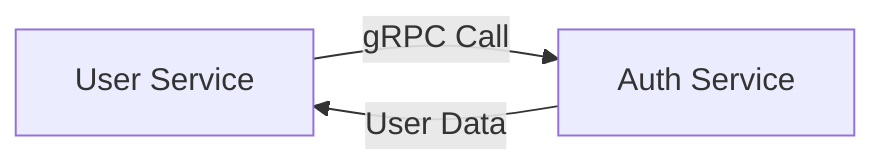

# MSA gRPC 아키텍처 가이드

## 개요

Career Lens 프로젝트를 MSA(Microservice Architecture) 구조로 전환하고, 서비스 간 gRPC 통신을 구현했습니다.

## 아키텍처 구조

### 🏗️ 서비스 구성

```
┌─────────────────┐    ┌─────────────────┐
│   Auth Service  │    │   User Service  │
│                 │    │                 │
│ HTTP: 3001      │    │ HTTP: 3002      │
│ gRPC: 50051     │    │ gRPC: 50052     │
└─────────────────┘    └─────────────────┘
         │                       │
         └───────────────────────┘
                    │
            gRPC Communication
```

### 📦 서비스별 역할

#### 1. Auth Service (인증 서비스)
- **포트**: HTTP 3001, gRPC 50051
- **역할**: 사용자 인증, JWT 토큰 관리, 비밀번호 관리
- **주요 기능**:
  - 회원가입/로그인
  - JWT 토큰 생성/검증
  - 비밀번호 변경
  - 사용자 정보 조회

#### 2. User Service (사용자 서비스)
- **포트**: HTTP 3002, gRPC 50052
- **역할**: 사용자 관리, 프로필 관리
- **주요 기능**:
  - 사용자 프로필 조회/수정
  - 사용자 목록 관리
  - 사용자 삭제 (소프트 삭제)
  - Auth Service와 gRPC 통신

## gRPC 통신 구조

### 🔄 서비스 간 통신



### 📋 Proto 파일 정의

#### auth.proto
```protobuf
service AuthService {
  rpc Signup(SignupRequest) returns (SignupResponse);
  rpc Login(LoginRequest) returns (LoginResponse);
  rpc VerifyToken(VerifyTokenRequest) returns (VerifyTokenResponse);
  rpc GetUser(GetUserRequest) returns (GetUserResponse);
  rpc ChangePassword(ChangePasswordRequest) returns (ChangePasswordResponse);
}
```

#### user.proto
```protobuf
service UserService {
  rpc GetUser(GetUserRequest) returns (GetUserResponse);
  rpc UpdateProfile(UpdateProfileRequest) returns (UpdateProfileResponse);
  rpc DeleteUser(DeleteUserRequest) returns (DeleteUserResponse);
  rpc GetUsers(GetUsersRequest) returns (GetUsersResponse);
}
```

## 구현 세부사항

### 🛠️ gRPC 서버 구현

#### Auth Service gRPC 컨트롤러
```typescript
@Controller()
export class AuthGrpcController {
  @GrpcMethod("AuthService", "Signup")
  async signup(data: any) {
    const request = new SignupRequest(data.name, data.email, data.password, data.sign_type);
    const result = await this.authApplicationService.signup(request);
    return {
      id: result.id,
      name: result.name,
      email: result.email,
      // ... 기타 필드
    };
  }
}
```

#### User Service gRPC 컨트롤러
```typescript
@Controller()
export class UserGrpcController {
  @GrpcMethod("UserService", "GetUser")
  async getUser(data: any) {
    // Auth Service에서 사용자 정보 조회
    const result = await this.authGrpcClient.getUser({ user_id: data.user_id }).toPromise();
    return result;
  }
}
```

### 🔌 gRPC 클라이언트 구현

```typescript
@Injectable()
export class AuthGrpcClient implements OnModuleInit {
  @Client({
    transport: 2, // Transport.GRPC
    options: {
      package: "auth",
      protoPath: join(__dirname, "../../../../proto/auth.proto"),
      url: process.env.AUTH_SERVICE_GRPC_URL || "localhost:50051",
    },
  })
  private client: ClientGrpc;

  private authService: any;

  onModuleInit() {
    this.authService = this.client.getService("AuthService");
  }

  getUser(data: { user_id: string }): Observable<any> {
    return this.authService.getUser(data);
  }
}
```

## Docker 설정

### 🐳 docker-compose.msa.yml

```yaml
services:
  postgres:
    image: postgres:15
    ports:
      - "5432:5432"
    environment:
      POSTGRES_DB: career_lens
      POSTGRES_USER: postgres
      POSTGRES_PASSWORD: password

  auth-service:
    build:
      context: .
      dockerfile: apps/auth-service/Dockerfile
    ports:
      - "3001:3001"  # HTTP
      - "50051:50051"  # gRPC
    environment:
      GRPC_URL: 0.0.0.0:50051
      DB_HOST: postgres

  user-service:
    build:
      context: .
      dockerfile: apps/user-service/Dockerfile
    ports:
      - "3002:3002"  # HTTP
      - "50052:50052"  # gRPC
    environment:
      GRPC_URL: 0.0.0.0:50052
      AUTH_SERVICE_GRPC_URL: auth-service:50051
    depends_on:
      - auth-service
```

## 실행 방법

### 🚀 로컬 개발 환경

#### 1. 의존성 설치
```bash
# Auth Service
cd apps/auth-service
npm install

# User Service
cd apps/user-service
npm install
```

#### 2. 데이터베이스 실행
```bash
docker-compose -f docker-compose.msa.yml up postgres -d
```

#### 3. 서비스 실행
```bash
# Auth Service
cd apps/auth-service
npm run start:dev

# User Service (새 터미널)
cd apps/user-service
npm run start:dev
```

### 🐳 Docker 환경

```bash
# 전체 MSA 환경 실행
docker-compose -f docker-compose.msa.yml up -d

# 로그 확인
docker-compose -f docker-compose.msa.yml logs -f
```

## API 엔드포인트

### 🔐 Auth Service (HTTP)

- `POST /auth/signup` - 회원가입
- `POST /auth/login` - 로그인
- `POST /auth/verify` - 토큰 검증
- `GET /auth/me` - 내 정보 조회 (인증 필요)
- `PUT /auth/change-password` - 비밀번호 변경 (인증 필요)

### 👤 User Service (HTTP)

- `GET /users/:id` - 사용자 정보 조회
- `PUT /users/:id/profile` - 프로필 수정
- `DELETE /users/:id` - 사용자 삭제
- `GET /users` - 사용자 목록 조회

### 🔄 gRPC 서비스

#### Auth Service gRPC
- `AuthService.Signup`
- `AuthService.Login`
- `AuthService.VerifyToken`
- `AuthService.GetUser`
- `AuthService.ChangePassword`

#### User Service gRPC
- `UserService.GetUser`
- `UserService.UpdateProfile`
- `UserService.DeleteUser`
- `UserService.GetUsers`

## 환경 변수

### 🔧 Auth Service
```env
NODE_ENV=development
PORT=3001
GRPC_URL=0.0.0.0:50051
DB_HOST=localhost
DB_PORT=5432
DB_USERNAME=postgres
DB_PASSWORD=password
DB_DATABASE=career_lens
JWT_SECRET=your-secret-key
```

### 🔧 User Service
```env
NODE_ENV=development
PORT=3002
GRPC_URL=0.0.0.0:50052
AUTH_SERVICE_GRPC_URL=localhost:50051
DB_HOST=localhost
DB_PORT=5432
DB_USERNAME=postgres
DB_PASSWORD=password
DB_DATABASE=career_lens
JWT_SECRET=your-secret-key
```

## 테스트

### 🧪 gRPC 통신 테스트

#### 1. Auth Service 테스트
```bash
# HTTP API 테스트
curl -X POST http://localhost:3001/auth/signup \
  -H "Content-Type: application/json" \
  -d '{"name":"홍길동","email":"test@example.com","password":"password123"}'
```

#### 2. User Service 테스트
```bash
# gRPC를 통한 사용자 조회 테스트
curl -X GET http://localhost:3002/users/1
```

### 🔍 gRPC 클라이언트 도구

```bash
# grpcurl 설치 (macOS)
brew install grpcurl

# 서비스 목록 확인
grpcurl -plaintext localhost:50051 list

# 메서드 호출
grpcurl -plaintext -d '{"user_id":"1"}' localhost:50051 auth.AuthService/GetUser
```

## 모니터링 및 로깅

### 📊 로그 확인

```bash
# Auth Service 로그
docker-compose -f docker-compose.msa.yml logs -f auth-service

# User Service 로그
docker-compose -f docker-compose.msa.yml logs -f user-service

# 전체 로그
docker-compose -f docker-compose.msa.yml logs -f
```

### 🔍 헬스 체크

```bash
# Auth Service 헬스 체크
curl http://localhost:3001/health

# User Service 헬스 체크
curl http://localhost:3002/health
```

## 확장 계획

### 🚀 향후 추가 예정

1. **API Gateway**: 서비스 통합 및 라우팅
2. **Service Discovery**: 서비스 자동 발견
3. **Circuit Breaker**: 장애 격리 및 복구
4. **Distributed Tracing**: 분산 추적
5. **Metrics & Monitoring**: 메트릭 수집 및 모니터링

### 📈 성능 최적화

1. **Connection Pooling**: gRPC 연결 풀링
2. **Load Balancing**: 로드 밸런싱
3. **Caching**: Redis 캐싱
4. **Database Sharding**: 데이터베이스 샤딩

## 문제 해결

### 🐛 일반적인 문제

#### 1. gRPC 연결 실패
```bash
# 포트 확인
netstat -tulpn | grep :50051
netstat -tulpn | grep :50052

# 서비스 상태 확인
docker-compose -f docker-compose.msa.yml ps
```

#### 2. Proto 파일 오류
```bash
# Proto 파일 컴파일 확인
protoc --version

# Proto 파일 문법 검사
protoc --proto_path=proto --go_out=. proto/*.proto
```

#### 3. 데이터베이스 연결 오류
```bash
# PostgreSQL 연결 확인
docker-compose -f docker-compose.msa.yml exec postgres psql -U postgres -d career_lens -c "SELECT 1;"
```

이 MSA gRPC 아키텍처를 통해 확장 가능하고 유지보수 가능한 마이크로서비스 시스템을 구축했습니다.
